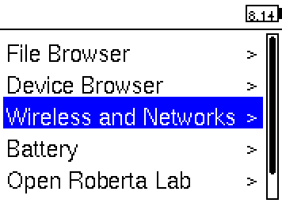
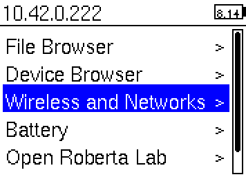
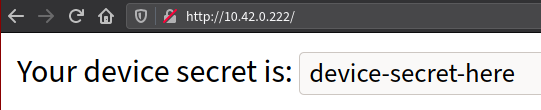
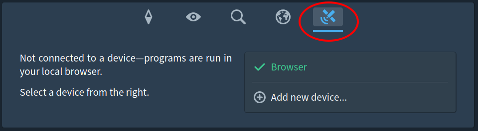
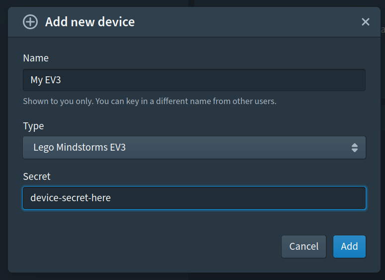

Welcome to the world of LEGO Mindstorms EV3! Work together with your teammates
to create the best robot and impress everyone.

## Quick links

### [EV3 library][ev3-docs]

### [Latest EV3-Source image][latest-img]

## Contents

1. [Environment setup](#1-environment-setup)
2. [Writing and testing your solutions](#2-writing-and-testing-your-solutions)

## 1. Environment setup

### Hardware setup

Instructions for a default robot design are included in the manual, which can be
found in the robot kit. Try that out if you don't know where to start. You are,
however, encouraged to come up with your own design!

For the mission, it must be a robot that your Studio has built. Sharing of the
same robot for grading, no matter using the same program or different programs,
is strictly **NOT** allowed.

### Installing the ev3dev image

Download the [Source Academy's customised ev3dev image from here][latest-img].
Then, use an image burner of your choice to install the image onto the microSD
card issued. You will require a microSD card reader for this. The instructions
for each operating system are as follows:

#### Cross-platform

Follow [this section &#40;"Flash the SD card"&#41; on the ev3dev
site](https://www.ev3dev.org/docs/getting-started/#step-2-flash-the-sd-card).
**Note: download the [customised EV3-Source image][latest-img], not the ev3dev
release image.**

Explorer/Finder may say that it is unable to read the card, or the card needs to
be formatted. That is normal; just dismiss the message. Etcher will be able to
flash the card.

If this does not work, try our [alternative instructions at the end of the
page](#appendix-alternative-flashing-instructions).

### Software setup

The environment that we have installed in the microSD card is a Linux
distribution from a project called [ev3dev](http://www.ev3dev.org/). You can
find out more about it from [the official website](http://www.ev3dev.org/). When
you press "Run" in the Source Academy, your programs will be compiled to the Sinter
Virtual Machine Language (SVML) by the Source Academy, the SVML code will be sent to
the robot through the internet, and the robot then runs the SVML code on the [Sinter virtual
machine](https://github.com/source-academy/sinter). (Please review Brief B5 to understand this process.)

This is what you should see when the EV3 has booted up with the microSD card
inserted.



Tip: the number you see at the top-right of the screen is the battery voltage in
volts. A fully charged battery should read somewhere around 8.3 V, and below 6
V, your battery will be running flat soon.

## 2. Writing and testing your solutions

### Introduction

Our customised EV3-Source image is integrated with the Source Academy. You can
simply register your device with the Source Academy, write your programs in the
playground in remote execution mode, and click "Run" as per normal to run your
programs on the robot.

### How to connect

The EV3 needs to connect to the Source Academy via your computer. It can connect
to your computer over USB or Bluetooth. (The benefit of Bluetooth is, of course,
that it is wireless, but it may be slightly less reliable.)

To connect your EV3 to the Internet via Bluetooth, follow [these
instructions](https://www.ev3dev.org/docs/tutorials/connecting-to-the-internet-via-bluetooth/).
To connect your EV3 via the USB wire provided, you can follow [these
instructions](https://www.ev3dev.org/docs/tutorials/connecting-to-the-internet-via-usb/).

Once you have connected successfully, you should see your EV3's local IP address
on the top left-hand corner of the EV3's screen.



Open `http://10.42.0.222/` in your browser, where `10.42.0.222` is the EV3's
local IP address, shown on the top left-hand corner of the EV3's screen.



Copy the device secret, then go to the Source Academy Playground and click on
the rightmost side content tab (Remote Execution).



Add a new device, give it a name and paste in the secret.



Then click on the new entry that is created. Once you see "Connected to &lt;your
device here&gt;.", you should be able to run programs on the EV3!


If you are stuck on "Connecting..." for a while, try selecting the device again
to attempt a re-connection.

This integration is still a work-in-progress, so there are definitely bugs.
Please let us know if you encounter any. Note that the "Pause" button, as well
as the REPL, chapter and library selectors are non-functional. We are still
working on the user interface; please bear with us!

There are some deviations between the full Source §3 and the Source §3 on the
device:

- These functions are not (yet) supported:
  - list_to_string
  - parse_int
  - get_time
  - prompt
  - stringify
- Numbers are single-precision floating points. This means that `16777216 + 1
  === 16777216`.

Avoid using large arrays. Note that sparse arrays are not supported, that is,
assigning to a large index in the array (e.g. `a[500]`) will create an array of
501 elements, the first 500 of which are `undefined`, and consume that much
space.

#### Tips

Multiple users can connect to the same device at the same time. If one user
clicks "Run", all users will see the device run and the device's output.

You can use this feature with the collaborative editing feature so that all
members of your Studio can work on the program together. You can also use it
with the Google Drive integration to save different programs that you write.

#### Troubleshooting

For macOS users, if you are running El Capitan (OS X 10.11) or higher, and
connect using USB, you might not see 'CDC Composite Gadget' in the interfaces
list under network configuration. Try to connect via Bluetooth instead.

### Examples

#### Example 1

```js
const motorA = ev3_motorA();
const motorB = ev3_motorB();

display(ev3_connected(motorA) ? "A connected" : "A not connected");
display(ev3_connected(motorB) ? "B connected" : "B not connected");

ev3_runToRelativePosition(motorA, 3000, 100);
ev3_runToRelativePosition(motorB, -2000, 100);
ev3_pause(1000);
```

#### Example 2

```js
const color = ev3_colorSensor();
if (ev3_reflectedLightIntensity(color) > 20) {
  // Do something
} else {
  // Do something else
}
```

### Source language

The language for this mission is Source §3 (including the list, streams and
arrays library), plus the special [EV3 library][ev3-docs].

[You can view the documentation for the EV3 library here.][ev3-docs]

Part of the fun is learning how to troubleshoot. If you have difficulties, start
by Googling your problems. For debugging, you can use the `display` function in
your programs. The output of `display` will then appear on your screen.

## Appendix: SSHing to the EV3

To SSH to the EV3, run

```bash
ssh robot@192.168.0.1
```

where `192.168.0.1` is the address shown at the top-left of the EV3.

Enter your password when prompted. The default password is `maker`.

If you are on Linux or macOS, you should have an SSH client already installed.
Windows 10 includes an SSH client from version 1803 onwards. On older versions
of Windows, you can use other SSH clients like [PuTTY](http://www.putty.org/).
The username is `robot`, and the hostname is the IP address shown on the
top-left of the EV3 screen.

## Appendix: Alternative flashing instructions

### Windows

- Download the Win32DiskImager software from
  [Sourceforge](https://sourceforge.net/projects/win32diskimager/files/Archive/Win32DiskImager-1.0.0-binary.zip/download).
- You should get a zip file named "Win32DiskImager-1.0.0-binary.zip".
- Unzip it and now you have a new folder called "Win32DiskImager-1.0.0-binary".
- If your computer has a slot for micro SD cards, insert the card. If not,
  insert the card into an SD card reader, then connect the reader to your
  computer.
- Run the file named **Win32DiskImager.exe** (in Windows Vista and higher, you
  may need to right-click this file and choose "Run as administrator").
- If the micro SD card (Device) you are using is not found automatically, then
  click on the drop down box on the right and select the micro SD card letter
  you just plugged in (e.g. [H:]).
- Be careful to select the correct drive; if you get the wrong one, you can
  destroy your data on your computer’s hard disk!
- In the Image File box, choose the `.img` file that you downloaded and click
  "Write". _Note: if a warning message appears, click YES._
- Your microSD card is ready to be used.

_Instructions adapted from
[udoo](https://www.udoo.org/docs-neo/Getting_Started/Create_a_bootable_MicroSD_card_for_UDOO_Neo.html)_

### macOS

For macOS users, we recommend [Etcher](https://etcher.io/). Otherwise, refer to
the Linux instructions to format your microSD card using the command line.

### Linux

0.  Unzip the `ev3-source.img.zip` downloaded earlier to get `ev3-source.img`.

        $ unzip ev3-source.img.zip
        Archive:  ev3-source.img.zip
          inflating: ev3-source.img

1.  Make sure that you SD card is **unplugged**. Then run `df`. You should see
    something like this:

        $ df -h
        Filesystem      Size  Used Avail Use% Mounted on
        /dev/sda1       119G   79G   34G  70% /
        none            4.0K     0  4.0K   0% /sys/fs/cgroup
        udev            7.8G   12K  7.8G   1% /dev
        tmpfs           1.6G  1.1M  1.6G   1% /run
        none            5.0M     0  5.0M   0% /run/lock
        none            7.9G  1.5M  7.9G   1% /run/shm
        none            100M  3.7M   97M   4% /run/user

2.  Now insert your SD card and run `df` again. See the new entry (`/dev/sdb1`)?
    That is your SD card. `sdb` is the actual device name and `1` is the
    partition number. Your actual device may be named something different.

        $ df -h
        Filesystem      Size  Used Avail Use% Mounted on
        /dev/sda1       119G   79G   34G  70% /
        none            4.0K     0  4.0K   0% /sys/fs/cgroup
        udev            7.8G   12K  7.8G   1% /dev
        tmpfs           1.6G  1.1M  1.6G   1% /run
        none            5.0M     0  5.0M   0% /run/lock
        none            7.9G  1.5M  7.9G   1% /run/shm
        none            100M  3.7M   97M   4% /run/user
        /dev/sdb1       2.0G  0.0G  2.0G   0% /media/user/LABEL

3.  Unmount your SD card. If it has more than one partition, you will need to do
    this for each partition.

        $ sudo umount /dev/sdb1

4.  This is the dangerous part. If you pick the wrong device, you could wipe out
    your hard drive, so BE CAREFUL!! When specifying the device, don't include
    the partition number.

    In this example we downloaded the compressed disk image file to
    `~/Downloads/` and our SD card is `/dev/sdb`. Adjust these values as needed.
    This will take a while.

        $ sudo dd if=~/Downloads/ev3-source.img of=/dev/sdb bs=4M \
              oflag=direct status=progress
        [sudo] password for user:

5.  When copying the image file has completed, run

        $ sync

    to make sure any cached disk writes have completed. Once `sync` is finished,
    it is safe to remove the SD card.

Adapted from [the ev3dev
website](https://www.ev3dev.org/docs/tutorials/writing-sd-card-image-linux-command-line/).

[latest-img]: https://github.com/source-academy/ev3-source/releases/download/sling-v0.0.4/ev3-source-sling-v0.0.4.img.zip
[ev3-docs]: https://docs.sourceacademy.org/EV3/
