<!-- markdownlint-disable-next-line blanks-around-headers -->
# EV3-Source OS Guide
{: .no_toc}

Welcome to the world of LEGO Mindstorms EV3! Work together with your teammates to create the best robot and impress everyone.

|              Quick Links              |
|:-------------------------------------:|
| [EV3 library documentation][ev3-docs] |
| [Latest EV3-Source image][latest-img] |

<!-- markdownlint-disable-next-line blanks-around-headers -->
## Table of Contents
{: .no_toc}

1. toc
{:toc}

## Setting up

### Background

#### Hardware setup

Instructions for a default robot design are included in the manual, which can be found in the robot kit. Try that out if you don't know where to start. You are, however, encouraged to come up with your own design!

For the mission, it must be a robot that your Studio has built. Sharing of the same robot for grading, no matter using the same program or different programs, is strictly **NOT** allowed.

#### Software setup

The environment that we have installed in the microSD card is a customised version of a Linux distribution from a project called [ev3dev](http://www.ev3dev.org/). You can find out more about it from [the official website](http://www.ev3dev.org/).

When you press "Run" in the Source Academy, your programs will be compiled to the Sinter Virtual Machine Language (SVML) by the Source Academy, the SVML code will be sent to the robot through the internet, and the robot then runs the SVML code on the [Sinter virtual machine](https://github.com/source-academy/sinter). (Please review Brief B5 to understand this process.)

### Installing EV3-Source on your robot

#### Windows, macOS, Linux

1. Download the [Source Academy's customised ev3dev image][latest-img].

1. Use an image burner (we recommend [Etcher](https://etcher.balena.io/)) to install the image onto the microSD card issued. You will require a microSD card reader for this.
  
   You may follow this guide (_"Flash the SD card"_ section) [from the ev3dev site](https://www.ev3dev.org/docs/getting-started/#step-2-flash-the-sd-card) to do so.

   **Note: Download the [customised EV3-Source image][latest-img], not the ev3dev release image.**

   File Explorer (Windows)/Finder (macOS) may say that it is unable to read the card, or the card needs to be formatted. This is **normal** and can be ignored. Etcher will be able to flash the card.

   If this does not work, try our [alternative instructions at the end of the page](#alternative-flashing-instructions).

1. Once the image has been flashed onto the microSD card, insert it into the EV3, but do not power it on yet.

1. Plug in the WiFi dongle into the USB port of the EV3.

### Starting up the EV3

1. Power on the EV3 by pressing the center button and wait for the main menu to appear. The first time you do this, it may take longer.

   **Note:** When powering it up for the first time, even after the main menu is shown, the EV3 is still configure some settings, and will **restart automatically** after. Please make sure you don't interrupt this process by pressing any buttons on the menu. The whole process usually takes around 10 minutes – my advice is to just leave it alone, grab a cup of coffee and come back later.

1. Once the EV3 is fully booted up, you should see the following screen:

   

   This means you are ready to proceed to the next step to connect to WiFi.

   _**Tip:** the number you see at the top-right of the screen is the battery voltage in volts. A fully charged battery should read somewhere around 8.3 V, and below 6 V, your battery will be running flat soon._

   _**Troubleshooting:** if you don't see the screen above, chances are your microSD card was not inserted properly, and thus the EV3 boots to its default OS instead. Try to power off the EV3 (top-left button), and removing and re-inserting the microSD card, making sure that it is not loose._

## Connecting the EV3 to Source Academy

### Introduction

Our customised EV3-Source image is integrated with the Source Academy. You can simply register your device with the Source Academy, write your programs in the playground in remote execution mode, and click "Run" as per normal to run your programs on the robot.

### Connecting the EV3 to WiFi

The preferred method of connecting the EV3 to the internet is via WiFi. This can be done in the ~~one of~~ the following way~~s~~:

<!-- #### Connecting to NUS_STU

Only one person per team needs to do this:

1. From the main menu, select "File Browser"

   

1. Select "Login to NUS_STU"

   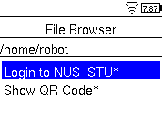

1. Key in your NUSNET user ID and press "Ok"

   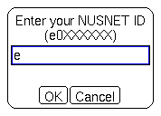

   Select the text field to open an on-screen keyboard, and use the up/down/left/right buttons to navigate the keys, and the center button to select a character. The top bar switches between lowercase, uppercase, numbers and symbols.

   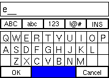
   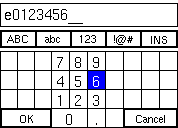

1. Key in your NUSNET password and press "Ok"

   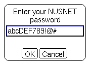

1. Confirm that your login details are correct and press "Quit" to return to the file browser. If you have keyed in your details incorrectly, simply re-run the program to update the EV3 with the correct credentials.

   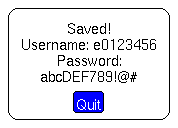

1. Go back to the main menu (use the button in the top-left corner to go back) and select "Wireless and Networks"

   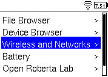

1. Select "Wi-Fi" and ensure it is powered on

   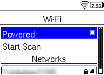

That's it! If your credentials are correct, the EV3 should connect to NUS_STU within a few seconds. If the EV3 does not detect the WiFi network, you may want to select "Start Scan" **once** to force a refresh. -->

#### Connecting to a personal hotspot

<!-- If you are not within range of NUS_STU, or if you prefer to use your own network, you can do the following instead: -->

1. From the main menu, select 'Wireless and Networks'
1. Select 'Wi-Fi' and ensure it is powered on
1. Select your network and connect to it. If your network is secured with a password, the EV3 will prompt you for one when you press 'Connect'

<!-- **Note:** NUS Wi-Fi may be having connection issues from time to time. If you see a "Status: Failed" message in the Wi-Fi menu entry for NUS_STU, try toggling the Wi-Fi off and on again. It may take multiple attempts at this. Alternatively, you may use a personal hotspot or other connection methods. -->

> **Troubleshooting**
>
> If connecting to WiFi does not work for some reason, please **ask for help in the forum**.
>
> Alternatively, the EV3 can also connect to your computer/phone over USB or Bluetooth. (The benefit of Bluetooth is, of course, that it is wireless, but it may be slightly less reliable.)
>
> * To connect your EV3 to the Internet via Bluetooth, follow [these instructions](https://www.ev3dev.org/docs/tutorials/connecting-to-the-internet-via-bluetooth/).
>
>   _Note: Bluetooth connection sharing no longer works with Windows 10 onwards. It remains working for macOS and Android. If you cannot use Bluetooth connection sharing, please use an alternative method._
>
> * To connect your EV3 via the USB wire provided, follow [these instructions](https://www.ev3dev.org/docs/tutorials/connecting-to-the-internet-via-usb/).

Once you have connected successfully, you should see your EV3's local IP address on the top left-hand corner of the EV3's screen. In this case, it's `192.168.139.113`. This means you are connected.

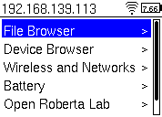

### Registering your EV3 with Source Academy

Everyone on the team will have to **individually** link their team's EV3 with their own Source Academy account.

There are two methods to register the EV3:

#### Method 1: Scanning a QR code

On a computer/mobile device (the latter is preferred because of a better camera):

1. Go to the [Source Academy Playground](https://sourceacademy.nus.edu.sg/playground) and select the "Remote Execution" tab (the one with the satellite icon)

   

1. Click on "Add new device..."

1. Enter a name for you to identify your device (the name is up to you, and need not be the same across team members)

   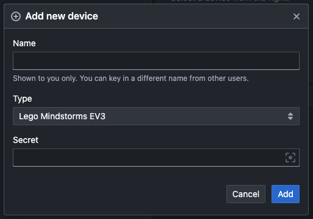

1. Click the button on the right side of the "Secret" field to open a QR code scanner. You may need to grant Source Academy access to your camera in the browser

1. You are now ready to scan the QR code on the EV3!

Then, on the EV3 device:

1. Go to the file browser and select "Show QR Code". A QR code will be shown on the screen (the following is only a sample, yours will be different):

   

   **Note:** There is a bug at the moment in that the first time you run "Show QR Code", the QR code may not be shown properly on the screen. Simply wait for it to disappear, run it again and it should work.

1. Place the EV3 such that the QR code is visible in the computer/phone's camera view in order to scan the QR code

After 10 seconds, the QR code will automatically disappear. If you need more time, simply select "Show QR Code" again. After scanning the code on your computer/phone, click the add button. You have succesfully linked the EV3 to your account!

> #### Method 2: Accessing the EV3 from a browser
>
> > Webserver is disabled by default. In order to do this, make sure you toggle "Enable Webserver" under [Source Academy Settings](#source-academy-settings) located on the EV3 file browser.
>
> Using a phone or computer, open `http://172.31.119.87/` in your browser, where `172.31.119.87` is the EV3's local IP address, shown on the top left-hand corner of the EV3's screen. You should get a page similar to below (the QR Code may or may not be shown):
>
> 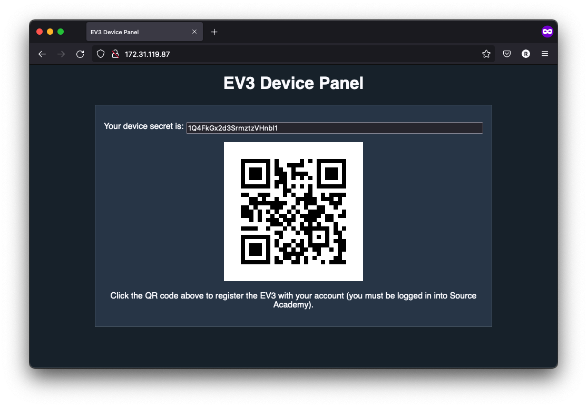
>
> Next, choose one of the following:
>
> **Method 2a (fastest):** If you're already logged in to Source Academy, click the QR code at the page. This will automatically pop up a dialog for you to pair the device on Source Academy. Give the device a name and add it to your account using similar steps as above. If you are not logged in, we strongly recommend you to log in and use this method.
>
> **Method 2b (adding manually):** Copy the device secret at the top of the page, then go to the Source Academy Playground and follow similar steps as above to add the device to your account, manually pasting in the secret.
>
> **Method 2c (last resort):** Scan the QR code on the webpage using another device and the [abovementioned method](#method-1-scanning-a-qr-code).

---

Click on the new entry that is created. Once you see "Connected to _<your_device_name>_.", you should be able to run programs on the EV3!

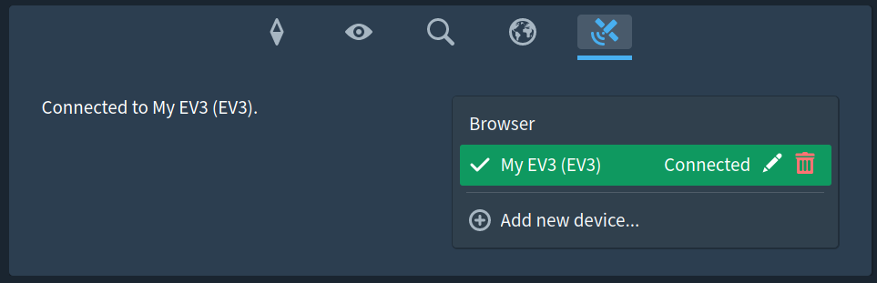

If you are stuck on "Connecting..." for a while, try selecting the device again to attempt a re-connection.

### Some things to take note

If you discover any bugs, please let us know in the forum.

Note that the "Pause" button, as well as the REPL, chapter and library selectors are non-functional. We are still working on the user interface; please bear with us!

There are some differences between the full Source §3 and the Source §3 on the device:

* These functions are not (yet) supported:
  * `list_to_string`
  * `parse_int`
  * `get_time`
  * `prompt`
  * `stringify`
* Numbers are single-precision floating points. This means that `16777216 + 1 === 16777216`.

* Avoid using large arrays.

  Note that sparse arrays are not supported, that is, assigning to a large index in the array (e.g. `a[500]`) will create an array of 501 elements, the first 500 of which are `undefined`, and consume that much space.

### Tips

* At any time, if you feel that the device secret has been compromised, you can invalidate and generate a new one using "Invalidate Bot Token" under [Source Academy Settings](#source-academy-settings). Afterwards, everyone will need to re-register their device on Source Academy using the new secret.
* Multiple users can connect to the same device at the same time. If one user clicks "Run", all users will see the device run and the device's output.
* You can use this feature with the collaborative editing feature so that all members of your Studio can work on the program together. You can also use it with the Google Drive integration to save different programs that you write.

#### Troubleshooting

For macOS users, and connect using USB, you might not see 'CDC Composite Gadget' in the interfaces list under network configuration. Try to connect via Bluetooth instead.

### Examples

#### Example 1

```js
const motorA = ev3_motorA();
const motorB = ev3_motorB();

display(ev3_connected(motorA) ? "A connected" : "A not connected");
display(ev3_connected(motorB) ? "B connected" : "B not connected");

ev3_runToRelativePosition(motorA, 3000, 100);
ev3_runToRelativePosition(motorB, -2000, 100);
ev3_pause(1000);
```

#### Example 2

```js
const color = ev3_colorSensor();
if (ev3_reflectedLightIntensity(color) > 20) {
  // Do something
} else {
  // Do something else
}
```

## Source language

The language for this mission is Source §3 (including the list, streams and arrays library), plus the special [EV3 library][ev3-docs].

[You can view the documentation for the EV3 library here.][ev3-docs]

Part of the fun is learning how to troubleshoot. If you have difficulties, start by Googling your problems. For debugging, you can use the `display` function in your programs. The output of `display` will then appear on your screen.

## Advanced

### Source Academy Settings

Source Academy Settings is a one-stop app to manage some of the customizations that are present on the EV3 image. Select "Source Academy Settings" from the file browser to launch it.

You can navigate the UI by using the up and down arrow keys on the EV3, and select an option by pressing the center button. There are the following available options.

|                        Option                        | Description                                                                                                                                                                                                        |
|:----------------------------------------------------:|:-------------------------------------------------------------------------------------------------------------------------------------------------------------------------------------------------------------------|
| 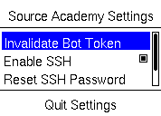 | Invalidates the device secret and generates a new one. Note that you still need to run the "Show QR Code" app separately in order to regenerate the QR code image.                                                 |
|      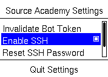      | Toggles SSH on/off. Off by default. Note that the UI may seem to freeze for a few seconds after pressing this button. This is normal; please do not spam the button or press other buttons while it is processing. |
|  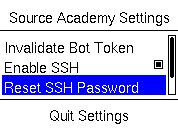  | Generates a new password for SSH login.                                                                                                                                                                            |
|   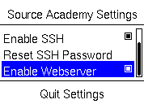   | Toggles whether to display the secret in the web server located at the EV3's IP address.                                                                                                                           |

### SSH-ing to the EV3

> **Note:** SSH is disabled by default. You need to enable SSH via [Source Academy Settings](#source-academy-settings) in order to use this feature.

The EV3 can also be accessed via SSH to get a full command line. To SSH to the EV3, run

```bash
ssh robot@192.168.0.1
```

where `192.168.0.1` is the address shown at the top-left of the EV3.

Enter your password when prompted. The default password is a random string, thus **you will need to generate a password first**. In [Source Academy Settings](#source-academy-settings), click "Reset SSH Password". You will see a pop up with the new password. Take note of this, as this is the only time you will be able to see it. If you ever forget the password, you can generate a new one using this same way.

If you are on Linux or macOS, you should have an SSH client already installed. Windows 10 includes an SSH client from version 1803 onwards. On older versions of Windows, you can use other SSH clients like [PuTTY](http://www.putty.org/). The username is `robot`, and the hostname is the IP address shown on the top-left of the EV3 screen.

## Appendix

### Alternative flashing instructions

#### Windows

* Download the Win32DiskImager software from [Sourceforge](https://sourceforge.net/projects/win32diskimager/files/Archive/Win32DiskImager-1.0.0-binary.zip/download).
* You should get a zip file named "Win32DiskImager-1.0.0-binary.zip".
* Unzip it and now you have a new folder called "Win32DiskImager-1.0.0-binary".
* If your computer has a slot for micro SD cards, insert the card. If not, insert the card into an SD card reader, then connect the reader to your computer.
* Run the file named **Win32DiskImager.exe** (in Windows Vista and higher, you may need to right-click this file and choose "Run as administrator").
* If the micro SD card (Device) you are using is not found automatically, then click on the drop down box on the right and select the micro SD card letter you just plugged in (e.g. [H:]).
* Be careful to select the correct drive; if you get the wrong one, you can destroy your data on your computer’s hard disk!
* In the Image File box, choose the `.img` file that you downloaded and click "Write". _Note: if a warning message appears, click YES._
* Your microSD card is ready to be used.

_Instructions adapted from [udoo](https://www.udoo.org/docs-neo/Getting_Started/Create_a_bootable_MicroSD_card_for_UDOO_Neo.html)_

#### macOS

For macOS users, we recommend [Etcher](https://etcher.io/). Otherwise, refer to the Linux instructions to format your microSD card using the command line.

#### Linux

1. Unzip the `ev3-source.img.zip` downloaded earlier to get `ev3-source.img`.

    ```bash
    $ unzip ev3-source.img.zip
    Archive:  ev3-source.img.zip
      inflating: ev3-source.img
    ```

1. Make sure that you SD card is **unplugged**. Then run `df`. You should see something like this:

    ```bash
    $ df -h
    Filesystem      Size  Used Avail Use% Mounted on
    /dev/sda1       119G   79G   34G  70% /
    none            4.0K     0  4.0K   0% /sys/fs/cgroup
    udev            7.8G   12K  7.8G   1% /dev
    tmpfs           1.6G  1.1M  1.6G   1% /run
    none            5.0M     0  5.0M   0% /run/lock
    none            7.9G  1.5M  7.9G   1% /run/shm
    none            100M  3.7M   97M   4% /run/user
    ```

1. Now insert your SD card and run `df` again. See the new entry (`/dev/sdb1`)? That is your SD card. `sdb` is the actual device name and `1` is the partition number. Your actual device may be named something different.

    ```bash
    $ df -h
    Filesystem      Size  Used Avail Use% Mounted on
    /dev/sda1       119G   79G   34G  70% /
    none            4.0K     0  4.0K   0% /sys/fs/cgroup
    udev            7.8G   12K  7.8G   1% /dev
    tmpfs           1.6G  1.1M  1.6G   1% /run
    none            5.0M     0  5.0M   0% /run/lock
    none            7.9G  1.5M  7.9G   1% /run/shm
    none            100M  3.7M   97M   4% /run/user
    /dev/sdb1       2.0G  0.0G  2.0G   0% /media/user/LABEL
    ```

1. Unmount your SD card. If it has more than one partition, you will need to do this for each partition.

    ```bash
    $ sudo umount /dev/sdb1
    ```

1. This is the dangerous part. If you pick the wrong device, you could wipe out your hard drive, so BE CAREFUL!! When specifying the device, don't include the partition number.

    In this example we downloaded the compressed disk image file to `~/Downloads/` and our SD card is `/dev/sdb`. Adjust these values as needed. This will take a while.

    ```bash
    $ sudo dd if=~/Downloads/ev3-source.img of=/dev/sdb bs=4M \
          oflag=direct status=progress
    [sudo] password for user:
    ```

1. When copying the image file has completed, run

    ```bash
    $ sync
    ```

    to make sure any cached disk writes have completed. Once `sync` is finished, it is safe to remove the SD card.

Adapted from [the ev3dev website](https://www.ev3dev.org/docs/tutorials/writing-sd-card-image-linux-command-line/).

[latest-img]: https://github.com/source-academy/ev3-source/releases/download/release-v0.2.0/ev3-source-release-v0.2.0.img.zip
[ev3-docs]: https://docs.sourceacademy.org/EV3/
